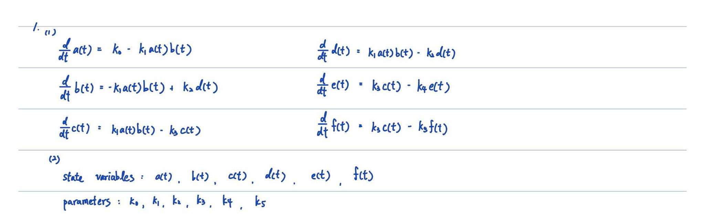

# Homework 1 Due: 1002
## 1.

---
## 2.

---
## 3.
### (a)
Solution implemented in with Python in `plot.py`

Result when $\nu = 0.05$ 

### (b)
Compare result of different $\nu$

$\nu = 0.0$

$\nu = 0.10$

$\nu = 0.30$

By comparing the results of different $\nu$, we can find that when $\nu$ increases, the number of susceptible individuals decreases faster, and the number of recovered individuals increases faster. This is because the vaccination rate $\nu$ reduces the number of susceptible individuals by vaccinating them, and also reduces the number of infected individuals by reducing the contact rate.